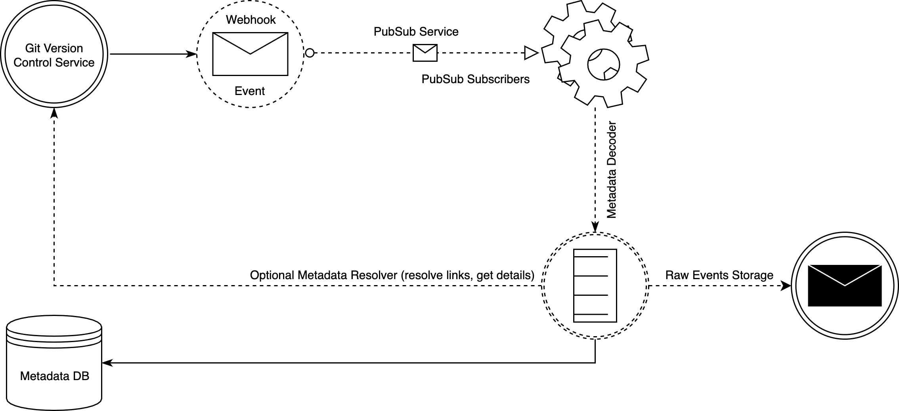

# Incremental Metadata Updates

Metadata is a service which updates our metadata storage. It relies on couple _hosted services_, but each of the following components should be scalable, fault tollerant and locally testable.

 

##### Git Version Control Service
Any git hosting service (like github, bitbucket, gitlab, ...) which exposes webhooks API (so far we only support github webhooks).

##### Webhook
Can be a _Cloud Function_ or generally _HTTP Service_ which can handle _Metadata Events_. The main responsibility of _Webhook_ is to receive and publish the event to _PubSub Service_

##### PubSub Service
Real-time messaging service. _PubSub_ supports _pull_ and _push_ mechanism to deliver messages.

##### Subscriber
Can be a _Cloud Function_ or _HTTP Service_ (like webhook). It will be triggered by _PubSub Service_ when the new event arrives (FIFO order is not guaranteed). The main responsibility of _Subscriber_ is to decode and deserialize the event, extract useful metadata, optionally go to the _Git Version Control Service_ for more detailed metadata. This last step (depends on complexity) can be realized either by internal process or by another service. The last step is to update our _Metadata Database_.
Subscriber may additionally backup events in _Raw Events Storage_.

##### Metadata Database
Schema based database where all repositories' metadata are stored. It's the main source of data for _Metrics API_.

##### Raw Events Storage
Can be _Distributted File System_ or any _Storage Service_ where we can backup raw events (just in case, if we want to re-publish them).

### Local testing
Current implementation requires running PostgreSQL database (see docker-compose.yml file) with pre-created schema (see schema.sql file):

```bash
$ POSTGRES_DB=test POSTGRES_USER=user POSTGRES_PASSWORD=password  docker-compose up --no-deps postgres
$ psql -h localhost -U user -W  -d test < schema.sql

$ make test-all
```